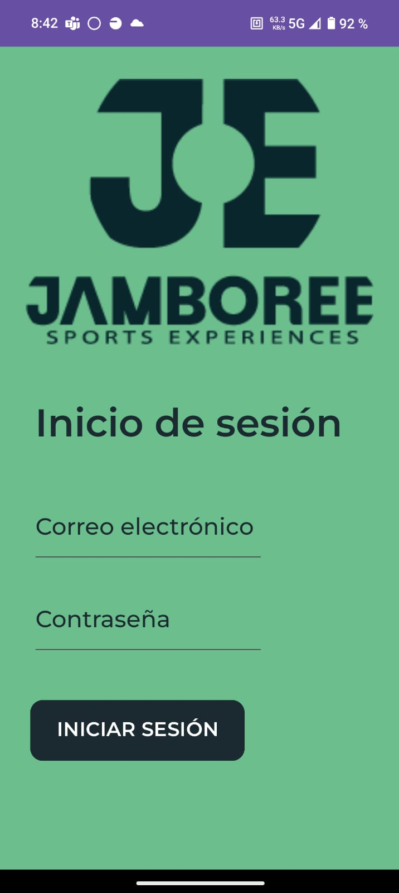
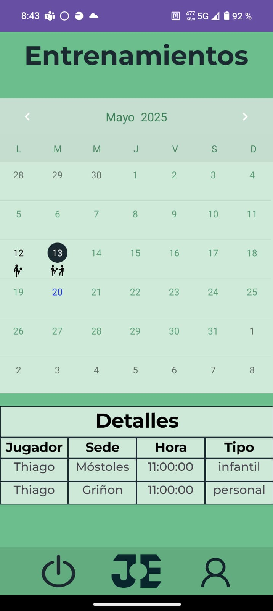
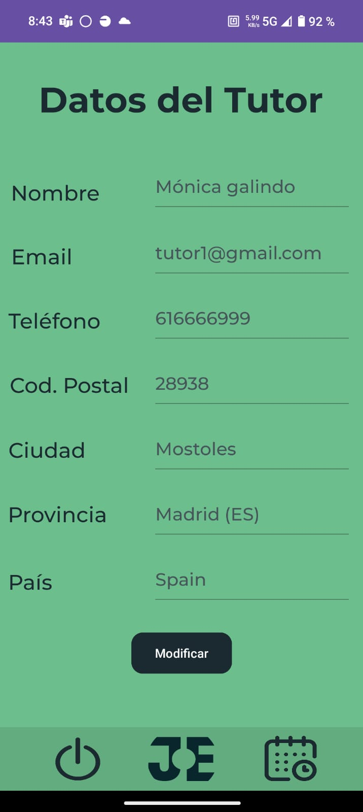

# Aplicación Móvil - Jamboree

Este directorio contiene el código fuente de la aplicación móvil desarrollada para interactuar con el sistema Odoo mediante su API externa.

  
  
  

## Funcionalidad

- Consulta de entrenamientos.
- Consulta de los datos de perfil.
- Modificación de los datos de perfil.

## Tecnologías Utilizadas

- Kotlin
- XML
- JSON-RPC2
- API externa de Odoo